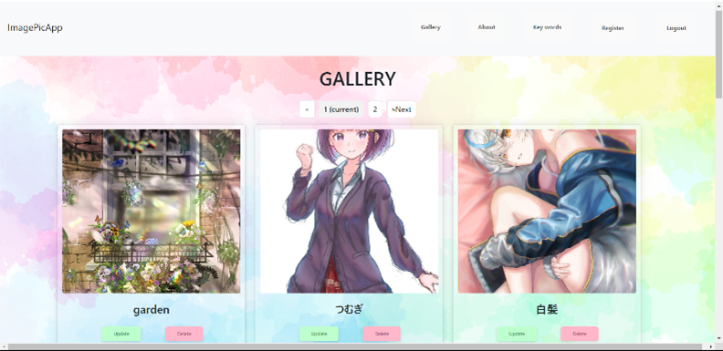

# ImagePicApp

https://imagepicapp.onrender.com
 
接続に時間がかかることがあります。
signupからメールアドレス（架空で構いません）とパスワード（半角英数6字以上）を登録してログインをお願いいたします。
詳細な使い方は下記URLをご参照ください。

 
<!-- VSCodeで実行する場合はお手数ですが、[<>Code ▼ → Download ZIP] よりZIPファイルをダウンロードしていただき、VSCodeで File>Open Folder... からImagePicApp-mainを開いてImagePicApp.pyファイルの実行をお願いいたします。'http://localhost:5000/' のリンクに飛ぶとImagePicAppをご利用いただけます。

  -->
ImagePicAppの説明がされているページです。
 
UIが変更されていますが基本的な機能は同じです。
 
https://yuto141592.github.io/about_ImagePicApp/

 
画像は自身の創作物になりますので著作権上の問題はございません。

 

# 概要
イラスト制作時の資料検索時間を削減するアプリケーション

# 詳細
PythonのフレームワークFlaskを用いて、イラスト作成者向けに参考資料収集時間削減を目的としたアプリケーションを独学で開発しました。デバイスから画像を保存し、画像のパスと任意設定のキーワードを紐づけてデータベースに保存することで、後から関連画像を一括で呼び出すことを可能にしました。

# 開発の経緯
私は趣味で絵を描いており、絵を描き始める際に参考にする資料の収集に時間がかかることが問題であると考えました。プロのイラストレーターの方の中にはイラスト作成よりも資料検索に時間をかける人もいます。そこで私は、絵を描き始める度に資料を収集するのではなく、一度収集した資料は、同じようなモチーフを描くときに後から簡単に呼び出せるようにして、ユーザーが自分だけの資料集をつくることができるアプリケーションを開発しようと思いました。

# 使用した技術
フロント：HTML/CSS 
サーバーサイド：Python 
データベース：PostgreSQL 
インフラ/その他：Render,Firebase 

 

# スマートフォンなどでアクセスした場合

    
    
    
    
    
    

# PCなどでアクセスした場合

    
    
    
    
    
    

